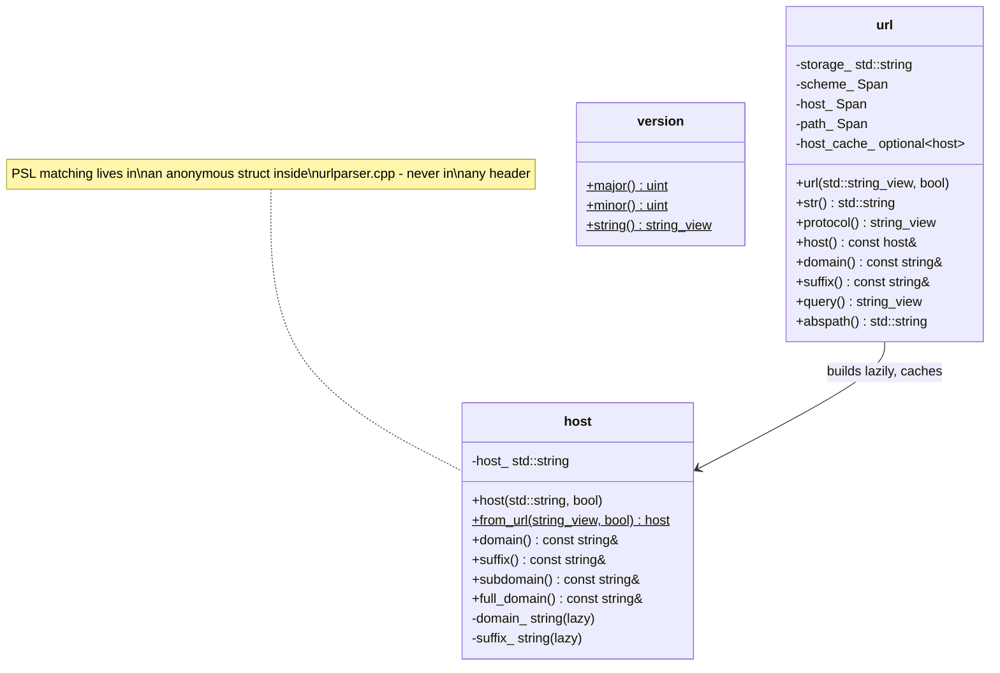
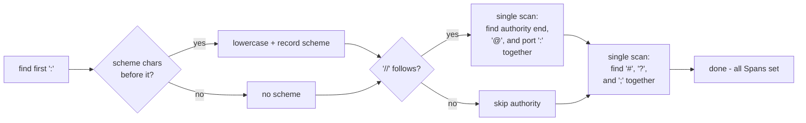
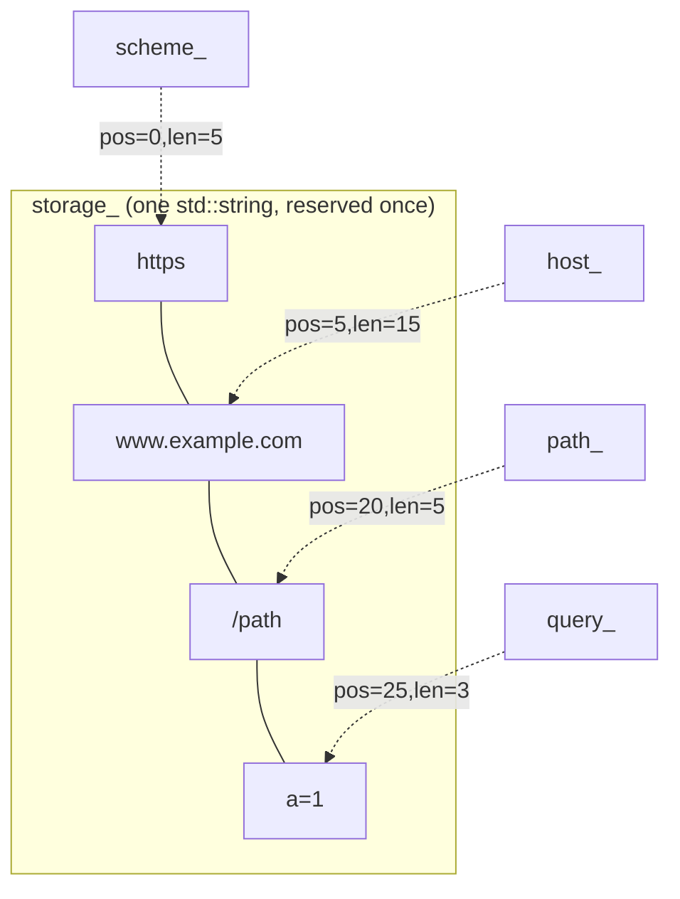
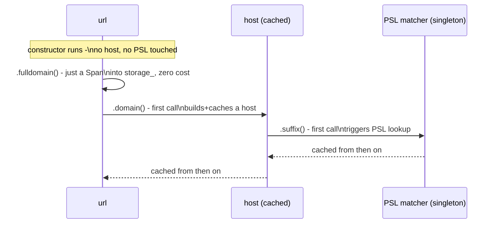
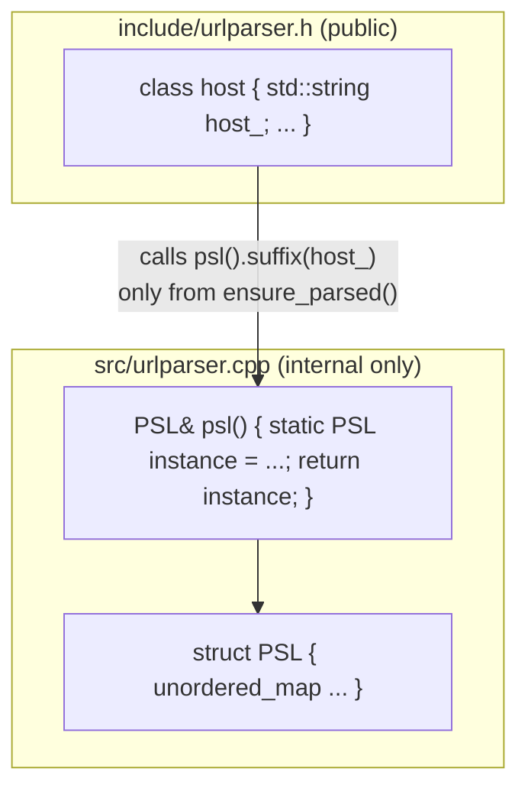
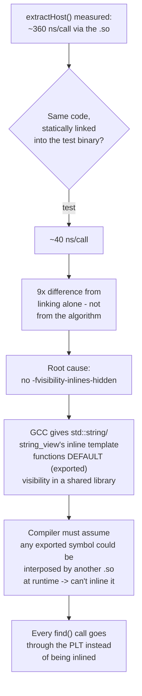

# liburlparser Architecture

This document explains how liburlparser is put together and, more
importantly, *why* — the performance techniques used, the trade-offs made,
and the mistakes found and fixed along the way. It assumes you already know
what the library does (parse a URL, split a hostname against the Public
Suffix List); it's about the "how" and "how fast".

## 1. The 10,000-foot view

The whole core of the library is **one header and one source file**:

```
include/urlparser.h    - public API: url, host, version
src/urlparser.cpp      - every implementation, including the PSL matcher
```

That's it. No PIMPL, no separate "detail" headers, no per-class files. This
wasn't the starting point — it's the result of repeatedly asking "does this
layer of indirection actually buy us anything?" and removing it when the
answer was no.



Both `url` and `host` are **plain value types**. Constructing one is a
stack-frame-sized object plus (at most) one heap allocation. Copying one is
a normal deep copy — no shared state, no reference counting, no surprises.

## 2. Namespaces

```
urlparser           - public API (url, host, version)
urlparser::detail   - the PSL matcher struct, ascii_tolower(), and the
                      character-class helpers. Never appears in a header.
```

`detail` (singular) was chosen over `details` because it's the more
established convention (Boost, fmt, libstdc++'s `__detail`). Class and
function names follow STL style throughout: lowercase types (`url`, `host`,
matching `std::string`, `std::vector`), snake_case methods
(`is_psl_loaded()`, `full_domain()`, `from_url()`). This isn't just taste —
the Python bindings are snake_case too, so the C++ and Python APIs now use
*identical* names instead of one being a translated version of the other.

One sharp edge worth documenting: a member function named `host()` inside
`class url` **hides** the type name `host` for every subsequent declaration
in that class body (standard C++ name-hiding rules — a member declaration
shadows an outer-scope name of the same identifier). The fix is to
fully-qualify: `urlparser::host` instead of bare `host` for anything
declared after the `host()` method itself.

## 3. Parsing: single pass, single buffer

### 3.1 One pass over the string

The constructor walks the input **once**, left to right, tracking scheme,
authority (userinfo/host/port), path, params, query, and fragment
boundaries as it goes — no backtracking, no re-scanning a region twice. The
authority section in particular finds its end, the `@` separator, and the
`:` port separator all in the same loop:



This replaced an earlier version that called `find()` /`find_first_of()`
three or four separate times over overlapping regions of the string.

### 3.2 One buffer, not seven

This is the biggest structural change. Every field (`scheme`, `userinfo`,
`host`, `path`, `params`, `query`, `fragment`) used to be its own
`std::string` — up to 7 separate heap allocations per `url`. Now there is
**one** owned buffer (`storage_`), and each field is a `(pos, len)` pair — a
`Span` — into it:



**Why exactly `url.size()` bytes, no more:** every field is a *substring* of
the input, with case-folding as the only transformation applied (which
never changes length). Delimiters (`://`, `@`, `:`, `?`, `#`, `;`) are
stripped, never kept. So the sum of every field's length is provably `<=
url.size()`. Reserving exactly that guarantees `storage_` never reallocates
during parsing — no guesswork, no 1.5× fudge factor needed. A small
`URLPARSER_ARENA_EXTRA_CAPACITY` macro (default 32 bytes, overridable
before `#include`) adds headroom for the future: if/when setters are added,
a value that grows past its original span gets appended at the end of
`storage_` (bump-allocator style) instead of reallocating immediately.

**Why offsets and not `std::string_view` fields directly:** a `string_view`
is a raw pointer + length. If `url` stored raw views into its own
`storage_` and you copied the `url` object, the default copy constructor
would deep-copy `storage_` to a *new* address but the views would still
point at the *old* buffer — dangling. Storing `(pos, len)` instead means
copying is just "copy the string, copy a few integers" — automatically
correct, no custom copy constructor needed, verified by an explicit
`CopyIsIndependentValue` test.

One side effect: several accessors (`protocol()`, `query()`, `fragment()`,
`userinfo()`, `fulldomain()`) now return `std::string_view` instead of
`const std::string&`, since they're views into the shared buffer rather
than independent owned strings. `domain()`/`subdomain()`/`suffix()` still
return `const std::string&`, because those come from `host`, which owns
them separately (see §4).

### 3.3 `host` is lazy — twice over

Two levels of laziness, because two different things are expensive for two
different reasons:



- `url` doesn't build a `host` at all until you call `.host()`,
  `.domain()`, `.subdomain()`, or `.suffix()` — stored as
  `mutable std::optional<host> host_cache_`, which adds zero allocation
  overhead of its own (inline storage + an engaged flag) compared to the
  earlier design's separate `unique_ptr<host>`.
- `host` itself doesn't touch the Public Suffix List until you call
  `.domain()`/`.subdomain()`/`.suffix()`/`.domain_name()`. Its own
  constructor just stores the string. `.full_domain()`/`.str()` have a
  **fast path**: with `ignore_www == false` (the common case), the answer
  is just the original host string — no PSL lookup, ever, for that call
  pattern.

Measured effect of this alone: `host::from_url(url).full_domain()` went
from ~2530 ns to ~150 ns for the common case.

## 4. The Public Suffix List

The PSL matcher (`urlparser::detail::PSL`, an `unordered_map<string, size_t>`
under the hood) lives **entirely inside `urlparser.cpp`** — not even
forward-declared in the header. `host`'s public surface never needs to
mention `unordered_map`, so there's nothing to hide via PIMPL in the first
place. That's really what made removing PIMPL safe: the *heavy* data
structure was never per-instance data to begin with, it was always shared,
global, static data.



- **Embedded at compile time.** The PSL data file is turned into a C++
  header (`public_suffix_list_dat.h`) by CMake at *configure* time
  (`configure_file`, so it exists right after `cmake -B build`, not only
  after a build). The header defines one string literal per line of the
  data file rather than one giant `R"(...)"` raw string, because a single
  300+ KB raw string or literal chokes MSVC's per-literal length limit;
  adjacent string-literal concatenation (`"a" "b"` → `"ab"`) has no such
  limit and is portable everywhere. The result: the library needs **no
  runtime file** at all — no `.dat` file to ship, find, or fail to find.
- **Safe lazy singleton.** `psl()` is a function-local `static` — the
  Meyers'-singleton pattern. This is deliberately *not* a namespace-scope
  `static PSL psl = ...;` initialized eagerly at program start, because
  that form is subject to the static-initialization-order fiasco across
  translation units. A function-local static initializes exactly once, on
  first use, thread-safely, per the C++11 standard guarantee.
- **Fast matching.** `PSL::suffix()` reverses and lowercases the hostname
  once, then does progressively-shorter hash-map lookups from most-specific
  to least-specific label. The reserve size for the map
  (`levels.reserve(10'000)`) was checked against the real PSL file — it has
  9,766 entries — so the reservation already sits comfortably above the
  actual count with no wasted rehashing and no guessing involved.

## 5. Micro-optimizations that mattered (and one that didn't)

These were each measured, not assumed:

| Change | Effect |
|---|---|
| `::tolower` → hand-written ASCII-only `tolower` | ~4× faster per call. `::tolower` goes through the current C locale on every single call; URLs are ASCII-only per RFC 3986 (internationalized domain names arrive already punycode-encoded), so a branchless range check is both correct and much cheaper. |
| `CharacterClass` (a heap-allocated `vector<bool>` bitset) → `constexpr` range-check functions | Removed a class and a heap allocation for what were really just two fixed character sets (scheme chars, digits). |
| `std::stoi` on a copied port substring → `std::from_chars` directly on the input | No intermediate allocation, no locale handling, no exceptions on the success path (error codes instead). |
| `Host(const std::string&)` → `Host(std::string)` taking ownership + `std::move` | Removed a hidden double-copy: the old signature meant `Host(extract_host(url), ...)` allocated once inside `extract_host()` and then copied *again* into the member — now it's one allocation, moved in. |
| `-fvisibility-inlines-hidden` on the library target | Found by direct measurement, not intuition (see below). |

**The one that backfired:** replacing `std::string::find()` /
`find_first_of()` with a hand-written character-by-character scanning loop,
expecting a single pass to beat three library calls. It didn't —
libstdc++'s `find()` implementations are already well-optimized, and a
naïve loop with branches lost to them (253 ns vs. 145 ns in a direct
comparison). Reverted. The lesson: don't fight the standard library's
string search without profiling first.

## 6. The shared-library trap

This was the single largest performance bug found in the whole project, and
it had nothing to do with algorithms.

`liburlparser` builds as a **static** library, not shared — and that
wasn't the original design. It started as `SHARED`, and a specific call —
`host::from_url(url, true)` inside a tight loop — was measured at roughly
**2.4 ms per 10,000 iterations**, several times slower than it had any
right to be. Chasing it down:



Two separate, compounding problems were found and fixed:

1. **Nothing in the project actually needed a shared library.** The Python
   extension compiles the sources directly into the nanobind module (it
   never links against `liburlparser.so`); the tests now compile
   `urlparser.cpp` directly too. Only the `example` program and the
   benchmark tool linked against the shared library — for no real reason.
   **Fix: build `urlparser` as `STATIC`.** Static linking has no PLT
   indirection at all for these calls in the first place.
2. Even for anyone who *does* want a shared build, `-fvisibility-inlines-hidden`
   is the standard, well-documented fix (see the GCC wiki's page on
   symbol visibility): it tells the compiler that inline functions —
   which is what nearly every `std::string`/`std::string_view` method
   is — don't need external, interposable linkage. Measured effect on
   `extractHost()` alone: **363 ns → 62 ns**, a 5.8× improvement, with zero
   change to any source code.

A second, unrelated build bug was found in the same investigation: three
lines in the top-level `CMakeLists.txt` did
`set(CMAKE_CXX_FLAGS_RELEASE "${CMAKE_CXX_FLAGS_RELEASE}" CACHE STRING ""
FORCE)` *before* `project()` was called. Since `CMAKE_CXX_FLAGS_RELEASE`
isn't populated with CMake's own defaults until `project()` runs, this
force-cached it to an **empty string**, silently discarding the normal
`-O3 -DNDEBUG` that a Release build should get. It had been there since
before this round of work and was quietly making every "Release" build of
the `example`/benchmark targets run without optimization. Removed.

Neither of these two things would show up in an isolated micro-benchmark
that compiles everything into one binary (which is exactly why they went
unnoticed for a while) — they only appear once you build the project the
way its own CMake actually builds it.

## 7. Testing philosophy

- **Golden data first.** `tests/data/{url,host}_data.csv` are real,
  hand-verified URL/host examples (including multi-level public suffixes
  like `co.uk`, `com.au`, `github.io`) checked against every accessor, not
  just a couple of fields.
- **Unit tests for anything with a subtle contract.** `str()` round-trips,
  `abspath()`'s `.`/`..` resolution, malformed-port exception paths,
  `operator==`, and — specifically — a `CopyIsIndependentValue` test for
  both `url` and `host`, added *because* the Span/offset redesign's whole
  safety argument rests on copies being independent.
- **Memory-leak checking is part of the normal test run, not a separate
  step.** `pytest-memray` is folded into the same `urlparser_test_python`
  target via a plain availability check (`if(NOT WIN32)` + "is it
  importable") — no CMake option to remember to flip on, no separate
  target to remember to run. It's skipped automatically on Windows, where
  `memray` itself isn't supported.
- **Benchmarks are a real target, not a one-off script.**
  `cmake --build build --target urlparser_benchmark_run` builds with `-O3`
  regardless of the outer build type (timing a debug build is meaningless)
  and reports the same set of scenarios every time, so regressions and
  improvements are comparable across changes.

## 8. What didn't change

- The public **behavior** — every golden-data test and every hand-written
  edge case from before the rewrite still passes with the same expected
  values. This was a set of internal restructurings for speed and clarity,
  not a change in what the library computes.
- The **version macros** (`URLPARSER_VERSION_MAJOR/MINOR/PATCH`) remain the
  single source of truth for the project's version, read by CMake
  (`cmake/DynamicVersion.cmake`), by `pyproject.toml`'s
  `scikit_build_core.metadata.regex` provider, and by `version.py` — one
  place to bump, three consumers.
