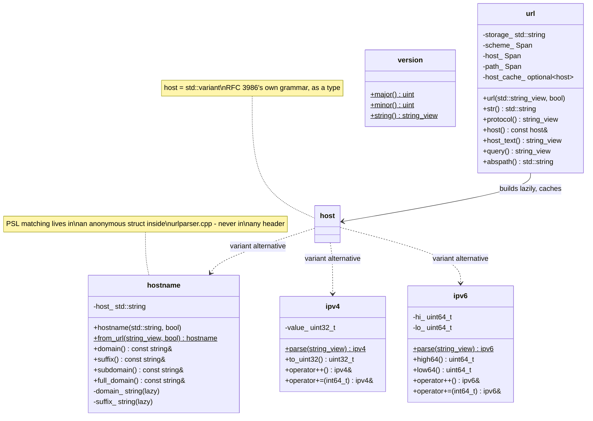
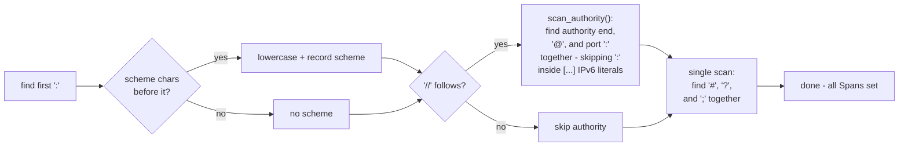
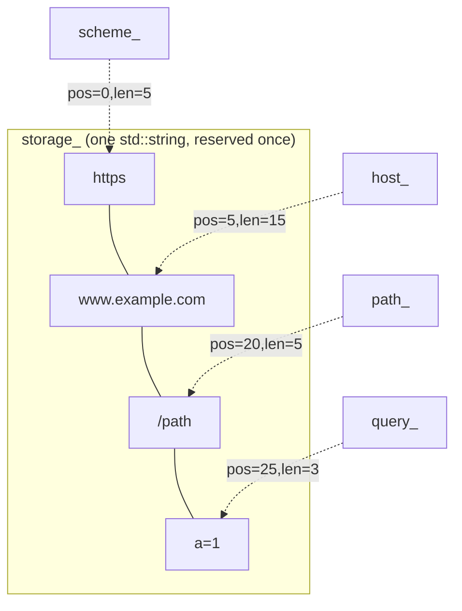
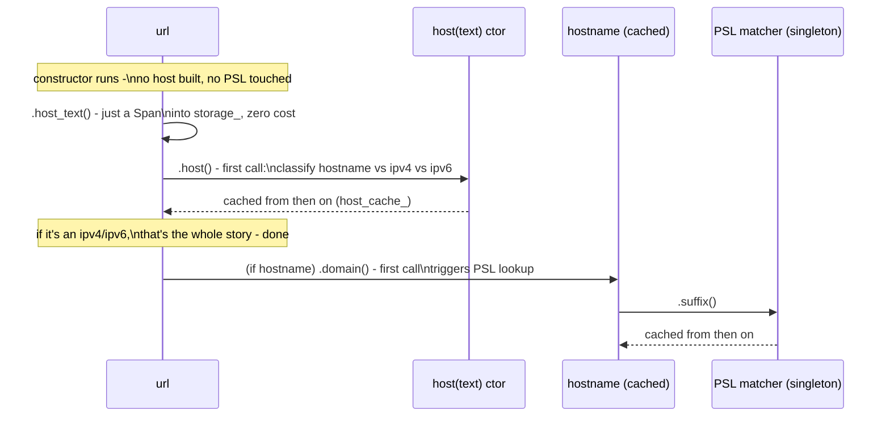
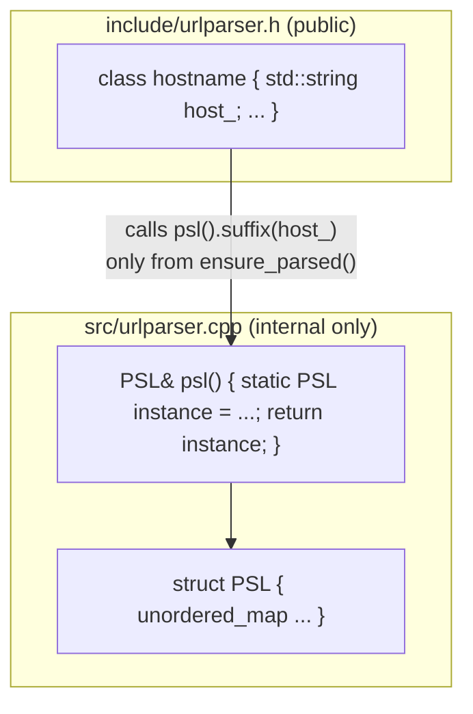
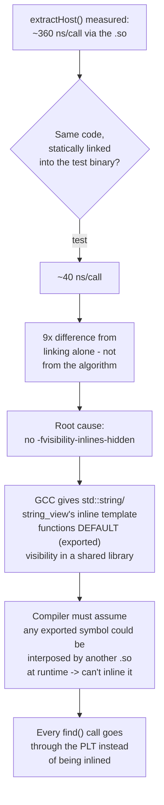

# liburlparser Architecture

This document explains how liburlparser is put together and, more
importantly, *why* — the performance techniques used, the trade-offs made,
and the mistakes found and fixed along the way. It assumes you already know
what the library does (parse a URL, classify and split its host); it's
about the "how" and "how fast".

## 1. The 10,000-foot view

The whole core of the library is **one header and one source file**:

```
include/urlparser.h    - public API: url, hostname, ipv4, ipv6, host, version
src/urlparser.cpp      - every implementation, including the PSL matcher
```

That's it. No PIMPL, no separate "detail" headers, no per-class files. This
wasn't the starting point — it's the result of repeatedly asking "does this
layer of indirection actually buy us anything?" and removing it when the
answer was no.

RFC 3986 defines a URL's host grammar as `host = IP-literal / IPv4address /
reg-name` — an IP address or a domain name, never both. The type design
mirrors that split directly instead of forcing every possible host through
one class:



`url`, `hostname`, `ipv4`, and `ipv6` are all **plain value types**.
Constructing one is a stack-frame-sized object plus (at most) one heap
allocation — `ipv4`/`ipv6` don't even need that, since a 32-bit/128-bit
address fits directly in the object (a `uint32_t`, or two `uint64_t`
halves). Copying any of them is a normal, independent copy — no shared
state, no reference counting, no surprises.

## 2. Namespaces

```
urlparser           - public API (url, hostname, ipv4, ipv6, host, version)
urlparser::detail   - the PSL matcher struct, ascii_tolower(), and the
                      character-class helpers. Never appears in a header.
```

`detail` (singular) was chosen over `details` because it's the more
established convention (Boost, fmt, libstdc++'s `__detail`). Class and
function names follow STL style throughout: lowercase types (`url`,
`hostname`, `ipv4`, `ipv6`, matching `std::string`, `std::vector`),
snake_case methods (`is_psl_loaded()`, `full_domain()`, `from_url()`). This
isn't just taste — the Python bindings use the same names (capitalized to
match Python class-naming convention: `Hostname`, `IPv4`, `IPv6`), so the
C++ and Python APIs stay recognizably the same API instead of one being a
loosely-related translation of the other.

One sharp edge worth documenting: a member function named `host()` inside
`class url` **hides** the type name `host` for every subsequent declaration
in that class body (standard C++ name-hiding rules — a member declaration
shadows an outer-scope name of the same identifier). The fix is to
fully-qualify: `urlparser::host` instead of bare `host` for anything
declared after the `host()` method itself — see `host_cache_`'s declaration
in the header for exactly this.

## 3. Parsing: single pass, single buffer

### 3.1 One pass over the string

The constructor walks the input **once**, left to right, tracking scheme,
authority (userinfo/host/port), path, params, query, and fragment
boundaries as it goes — no backtracking, no re-scanning a region twice. The
authority section in particular finds its end, the `@` separator, and the
`:` port separator all in the same loop:



`scan_authority()` is a single free function, shared by both `url::url()`
(the full parser) and `url::extract_host()` (the cheap host-only
shortcut) — they used to be two independently-written scans, which is
exactly how a real bug shipped: the cheap-shortcut version didn't know
about `:` (port) or `#` (fragment) at all, so `extract_host("https://
example.com:8080/x")` silently glued the port digits onto the returned
host. Fixed by deleting the second implementation and making both callers
share the one, now also bracket-aware for IPv6 (`[::1]:8080`'s address
colons are never mistaken for the port separator).

### 3.2 One buffer, not seven

This is the biggest structural change in `url`. Every field (`scheme`,
`userinfo`, `host`, `path`, `params`, `query`, `fragment`) used to be its
own `std::string` — up to 7 separate heap allocations per `url`. Now there
is **one** owned buffer (`storage_`), and each field is a `(pos, len)`
pair — a `Span` — into it:



**Why exactly `url.size()` bytes, no more:** every field is a *substring* of
the input, with case-folding as the only transformation applied (which
never changes length). Delimiters (`://`, `@`, `:`, `?`, `#`, `;`) are
stripped, never kept. So the sum of every field's length is provably `<=
url.size()`. Reserving exactly that guarantees `storage_` never reallocates
during parsing — no guesswork, no fudge factor, and no speculative
headroom "for future setters" either: an earlier version of this code
reserved an extra 32 bytes for exactly that reason, but nothing ever grew
into it (`url` has no setters), so it was pure waste on every single `url`
constructed. Removed — `storage_` now takes exactly what parsing needs.

**Why offsets and not `std::string_view` fields directly:** a `string_view`
is a raw pointer + length. If `url` stored raw views into its own
`storage_` and you copied the `url` object, the default copy constructor
would deep-copy `storage_` to a *new* address but the views would still
point at the *old* buffer — dangling. Storing `(pos, len)` instead means
copying is just "copy the string, copy a few integers" — automatically
correct, no custom copy constructor needed, verified by an explicit
`CopyIsIndependentValue` test.

One side effect: most accessors (`protocol()`, `query()`, `fragment()`,
`userinfo()`, `host_text()`) return `std::string_view` instead of
`const std::string&`, since they're views into the shared buffer rather
than independent owned strings. `hostname::domain()`/`subdomain()`/
`suffix()` still return `const std::string&`, because `hostname` owns them
separately (see §4) — but note that these live on `hostname`, not on `url`
directly, for the reason covered next.

### 3.3 `url::host()` classifies before it caches

`url` itself has **no** `domain()`/`subdomain()`/`suffix()` methods, and
deliberately so. Those concepts don't apply to every URL: `http://
192.168.1.1/` has a host, but no "domain" or "public suffix" in any
meaningful sense — running an IP address through Public-Suffix-List
matching anyway (an earlier version of this library did exactly that) just
produces confident-looking garbage (`suffix() == "1"`, `domain() == "1"`
for `"192.168.1.1"`, since the PSL matcher has no idea it isn't looking at
a domain name at all).

Instead, `url::host()` returns `const host&`, where `host` wraps
`std::variant<hostname, ipv4, ipv6>` — exactly RFC 3986's own grammar,
behind a uniform API matching hostname/ipv4/ipv6/url themselves
(a constructor that classifies, `from_url()`, `str()`). Getting
`domain()`/`suffix()` back means narrowing first:

```cpp
if (auto* h = url.host().try_hostname()) {
    std::cout << h->domain() << "." << h->suffix();
}
```

which is more ceremony than a bare `url.domain()` call, on purpose: it's
the compiler (and the reader) being told, explicitly, "this only makes
sense if the host isn't an IP address" — instead of that assumption being
silently baked into what `url.domain()` used to return for an IP host.
`host` is composition over `std::variant`, not inheritance from it —
deriving public classes from a standard container is a well-known footgun
(no virtual destructor, and an interface you don't fully control) — so
`is_hostname()`/`is_ipv4()`/`is_ipv6()`, `get_hostname()`/`get_ipv4()`/
`get_ipv6()` (throwing, like `std::get<T>()`), and `try_hostname()`/
`try_ipv4()`/`try_ipv6()` (non-throwing, like `std::get_if<T>()`) are
hand-written wrappers around the internal variant; `.variant()` gives
direct access to it for `std::visit` or structured, exhaustive handling.

`host`'s own constructor does the classification: try `ipv4::is_valid()`,
then `ipv6::is_valid()` (both just call the platform's own `inet_pton`/
`InetPtonA` — see §4.1), and fall back to `hostname` if neither matches.
`url::ensure_host()` calls exactly this constructor, once, the first time
`.host()` is requested.

### 3.4 `host` is lazy — twice over

Two levels of laziness, because two different things are expensive for two
different reasons:



- `url` doesn't build a `host` at all until you call `.host()` — stored as
  `mutable std::optional<host> host_cache_`, which adds zero allocation
  overhead of its own (inline storage + an engaged flag) compared to a
  separate `unique_ptr<host>`.
- If classification lands on `ipv4`/`ipv6`, there's nothing further to
  defer — the whole address is already a plain integer/integer-pair, no
  PSL involved at all, ever.
- If it's a `hostname`, *that* doesn't touch the Public Suffix List until
  you call `.domain()`/`.subdomain()`/`.suffix()`/`.domain_name()`. Its own
  constructor just stores the string. `.full_domain()`/`.str()` have a
  **fast path**: with `ignore_www == false` (the common case), the answer
  is just the original host string — no PSL lookup, ever, for that call
  pattern.

Measured effect of the `hostname` fast path alone:
`hostname::from_url(url).full_domain()` went from ~2530 ns to ~150 ns for
the common case.

## 4. IP addresses: `ipv4` and `ipv6`, not one `ip` class

Two dedicated classes, not `class ip { family f; array<uint8_t,16> b; }`
with a family tag. This was a deliberate choice over the more
"generic-looking" single-class design, for reasons that hold up under
actual measurement:

- **Representation.** `ipv4` is a bare `uint32_t`; `ipv6` is two `uint64_t`
  (`hi_`, `lo_`). Comparisons, `++`/`--`/`+=`/`-=` compile down to native
  integer instructions — for `ipv4`, one add/subtract; for `ipv6`, one
  64-bit add-with-carry between two limbs. A combined 16-byte-array-plus-
  family-tag design would mean branching on the family and looping over 4
  or 16 bytes for every single operation, for both address kinds, all the
  time — real, avoidable overhead sitting in the hottest path.
- **Honesty in the type signature.** `ipv4::to_uint32()` is `noexcept` and
  always valid — it doesn't need to be, because it's simply not a method
  that exists on `ipv6` at all. A single `ip` class's `to_uint32()` would
  have to throw for v6 inputs at runtime; needing a runtime check for
  "is this operation even valid for what I'm holding" is usually a sign a
  class is really two different things wearing one name.
- **`ipv6`'s own integer-ish access** is `high64()`/`low64()` (the address
  as its two 64-bit halves) rather than a single 128-bit integer, since
  C++17 has no portable 128-bit integer type (`__uint128_t` is a GCC/Clang
  extension, not something this library depends on given it also targets
  MSVC).

### 4.1 Parsing: the platform's own `inet_pton`/`inet_ntop`, not hand-written

IPv4's text format has more edge cases than "four dot-separated numbers"
(leading zeros, legacy octal/hex octets in some parsers), and IPv6's has
many more (`::` compression, embedded IPv4 tails like `::ffff:192.0.2.1`,
zone IDs on some platforms). `ipv4`'s/`ipv6`'s constructors and their
`is_valid()` counterparts call `inet_pton` (POSIX, `<arpa/inet.h>`) or
`InetPtonA` (Windows, `<ws2tcpip.h>`) instead of re-deriving that grammar
by hand; formatting back to text uses the matching `inet_ntop`/`InetNtopA`,
which also guarantees RFC 5952 canonical form (lowercase, `::`-compressed)
for `ipv6::str()` for free. This is the same "prefer the platform/stdlib
over hand-rolled parsing" instinct behind using `std::from_chars` for port
numbers (§5) — IPv6 in particular is exactly the kind of grammar where a
hand-written parser is far more likely to introduce a subtle bug than to
avoid one.

### 4.2 A URL's host span includes IPv6's brackets, on purpose

`url::extract_host()`/`url::host_text()` return `"[2001:db8::1]"` —
brackets included — for a bracketed IPv6 URL, rather than stripping them.
This matches RFC 3986's own `IP-literal = "[" ( IPv6address / IPvFuture )
"]"` grammar: the brackets are part of the host component. `ipv6`'s
constructor and `is_valid()` strip them internally before handing the text
to `inet_pton` (which doesn't understand brackets itself), so callers
never need to think about this either way — `ipv6("[::1]")` and
`ipv6("::1")` produce the identical address.

## 5. The Public Suffix List

The PSL matcher (`urlparser::detail::PSL`, an `unordered_map<string, size_t>`
under the hood) lives **entirely inside `urlparser.cpp`** — not even
forward-declared in the header. `hostname`'s public surface never needs to
mention `unordered_map`, so there's nothing to hide via PIMPL in the first
place. That's really what made removing PIMPL safe: the *heavy* data
structure was never per-instance data to begin with, it was always shared,
global, static data — and, since `ipv4`/`ipv6` never touch the PSL at all,
it's not even loaded into anything on their path.



- **Embedded at compile time.** The PSL data file is turned into a C++
  header (`public_suffix_list_dat.h`) by CMake at *configure* time
  (`configure_file`, so it exists right after `cmake -B build`, not only
  after a build). The header defines one string literal per line of the
  data file rather than one giant `R"(...)"` raw string, because a single
  300+ KB raw string or literal chokes MSVC's per-literal length limit;
  adjacent string-literal concatenation (`"a" "b"` → `"ab"`) has no such
  limit and is portable everywhere. The result: the library needs **no
  runtime file** at all — no `.dat` file to ship, find, or fail to find.
- **Safe lazy singleton.** `psl()` is a function-local `static` — the
  Meyers'-singleton pattern. This is deliberately *not* a namespace-scope
  `static PSL psl = ...;` initialized eagerly at program start, because
  that form is subject to the static-initialization-order fiasco across
  translation units. A function-local static initializes exactly once, on
  first use, thread-safely, per the C++11 standard guarantee.
- **Fast matching.** `PSL::suffix()` reverses and lowercases the hostname
  once, then does progressively-shorter hash-map lookups from most-specific
  to least-specific label. The reserve size for the map
  (`levels.reserve(10'000)`) was checked against the real PSL file — it has
  9,766 entries — so the reservation already sits comfortably above the
  actual count with no wasted rehashing and no guessing involved.

## 6. Micro-optimizations that mattered (and some that didn't)

These were each measured, not assumed:

| Change | Effect |
|---|---|
| `::tolower` → hand-written ASCII-only `tolower` | ~4× faster per call. `::tolower` goes through the current C locale on every single call; URLs are ASCII-only per RFC 3986 (internationalized domain names arrive already punycode-encoded), so a branchless range check is both correct and much cheaper. |
| `CharacterClass` (a heap-allocated `vector<bool>` bitset) → `constexpr` range-check functions | Removed a class and a heap allocation for what were really just two fixed character sets (scheme chars, digits). |
| `std::stoi` on a copied port substring → `std::from_chars` directly on the input | No intermediate allocation, no locale handling, no exceptions on the success path (error codes instead). |
| `hostname(const std::string&)` → overload set of `string_view` / `const char*` / `const std::string&` / `std::string&&` | The `string_view`/`const char*` overloads let a caller with only a borrowed buffer (e.g. nanobind's zero-copy Python-string caster) avoid any allocation beyond the final `hostname`'s own string; the `string&&` overload lets a caller with an owned, disposable string (e.g. `urlparser::host::from_url(std::move(url))`) reuse that buffer via `erase()` instead of copying into a new one. Verified with a direct allocation-count check (`operator new`/`delete` override), not just timing: the rvalue path went from 1 allocation to 0 for the classification step. |
| `-fvisibility-inlines-hidden` on the library target | Found by direct measurement, not intuition (see §7). |

**The one that backfired:** replacing `std::string::find()` /
`find_first_of()` with a hand-written character-by-character scanning loop,
expecting a single pass to beat three library calls. It didn't —
libstdc++'s `find()` implementations are already well-optimized, and a
naïve loop with branches lost to them (253 ns vs. 145 ns in a direct
comparison, and separately confirmed again while investigating a possible
optimization for `extract_host()`'s `find_first_of("?/", pos)`: 22.9 ns for
a hand-written loop vs. 14.6 ns for the library call). Reverted both times.
The lesson: don't fight the standard library's string search without
profiling first — twice, apparently.

**Another one that backfired:** compiling with `-flto` to let
`host::from_url()` inline across the (previously separate) translation
unit boundary between the static library and its caller. Measured
consistently *slower* (≈76 ns vs. ≈61 ns across repeated interleaved runs)
rather than faster — LTO's own inlining heuristics evidently made a worse
call here than the non-LTO baseline. Not enabled.

## 7. The shared-library trap

This was the single largest performance bug found in the whole project, and
it had nothing to do with algorithms.

`liburlparser` builds as a **static** library, not shared — and that
wasn't the original design. It started as `SHARED`, and a specific call —
`hostname::from_url(url, true)` inside a tight loop — was measured at
roughly **2.4 ms per 10,000 iterations**, several times slower than it had
any right to be. Chasing it down:



Two separate, compounding problems were found and fixed:

1. **Nothing in the project actually needed a shared library.** The Python
   extension compiles the sources directly into the nanobind module (it
   never links against `liburlparser.so`); the tests now compile
   `urlparser.cpp` directly too. Only the `example` program and the
   benchmark tool linked against the shared library — for no real reason.
   **Fix: build `urlparser` as `STATIC`.** Static linking has no PLT
   indirection at all for these calls in the first place.
2. Even for anyone who *does* want a shared build, `-fvisibility-inlines-hidden`
   is the standard, well-documented fix (see the GCC wiki's page on
   symbol visibility): it tells the compiler that inline functions —
   which is what nearly every `std::string`/`std::string_view` method
   is — don't need external, interposable linkage. Measured effect on
   `extractHost()` alone: **363 ns → 62 ns**, a 5.8× improvement, with zero
   change to any source code.

A second, unrelated build bug was found in the same investigation: three
lines in the top-level `CMakeLists.txt` did
`set(CMAKE_CXX_FLAGS_RELEASE "${CMAKE_CXX_FLAGS_RELEASE}" CACHE STRING ""
FORCE)` *before* `project()` was called. Since `CMAKE_CXX_FLAGS_RELEASE`
isn't populated with CMake's own defaults until `project()` runs, this
force-cached it to an **empty string**, silently discarding the normal
`-O3 -DNDEBUG` that a Release build should get. It had been there since
before this round of work and was quietly making every "Release" build of
the `example`/benchmark targets run without optimization. Removed.

Neither of these two things would show up in an isolated micro-benchmark
that compiles everything into one binary (which is exactly why they went
unnoticed for a while) — they only appear once you build the project the
way its own CMake actually builds it.

## 8. The nanobind bindings: same allocation discipline, applied at the Python boundary

`src/binding/main.cpp` exposes `Hostname`, `IPv4`, `IPv6`, and `Url` via
nanobind - including `Host`, `Hostname`, `IPv4`, `IPv6`. Two
details worth calling out because they weren't obvious until measured:

- **`std::variant` support is native.** `#include <nanobind/stl/variant.h>`
  is enough for `url::host()`'s `std::variant<hostname, ipv4, ipv6>` return
  value to automatically become a `Hostname`, `IPv4`, or `IPv6` Python
  object — whichever alternative it actually holds — with no manual
  dispatch code in the binding itself.
- **Which overload gets bound changes allocation count, not just which
  one compiles.** nanobind has a *zero-copy* `std::string_view` caster (it
  wraps CPython's own cached UTF-8 buffer directly, no copy at all) in
  addition to its `std::string` caster (which always copies once). Because
  of this, `Url.extract_host` and `Host.from_url` are
  explicitly bound to their `std::string_view` overloads rather than
  `const std::string&` or `std::string&&` ones — confirmed with an
  `LD_PRELOAD` malloc-counting shim (`benchmark/python/`), not assumed:
  `Host.from_url` dropped from 2 mallocs/call to 1 once rebound this way.
  A same-looking `std::string&&` binding would still have forced nanobind
  to make its own owning copy first, since the caster machinery always
  materializes a real `std::string` before anything can be moved out of
  it — the win here specifically comes from skipping that materialization
  altogether via `string_view`, not from moving after the fact.
- **A returned property must be an independent copy, not a live
  reference.** `Url.host` is explicitly bound with `nb::rv_policy::copy`.
  Without it, mutating a returned `IPv4`/`IPv6` in Python (`host += 1`)
  would silently mutate the `Url`'s own cached host too, since nanobind's
  default reference-value policy for a `const T&`-returning property
  otherwise shares the underlying C++ object rather than copying it —
  exactly the kind of action-at-a-distance bug a plain value type is
  supposed to make impossible.

## 9. Testing philosophy

- **Golden data first.** `tests/data/{url,host}_data.csv` are real,
  hand-verified URL/host examples (including multi-level public suffixes
  like `co.uk`, `com.au`, `github.io`, and rows with an explicit port)
  checked against every accessor, not just a couple of fields.
- **Unit tests for anything with a subtle contract.** `str()` round-trips,
  `abspath()`'s `.`/`..` resolution, malformed-port exception paths,
  `operator==`, `CopyIsIndependentValue` for `url` and `hostname` (the
  Span/offset redesign's whole safety argument rests on copies being
  independent), IPv4/IPv6 wraparound arithmetic including the
  `delta == INT64_MIN` edge case (negating it as a signed `int64_t` is
  undefined behavior — `operator-=` computes the two's-complement bit
  pattern directly instead, in unsigned arithmetic, which is always
  well-defined), and explicit regression tests for the port/fragment/
  IPv6-bracket host-boundary bugs described in §3.1.
- **Regression tests are written from a real, reproduced failure, not from
  imagining what could go wrong.** Every bug mentioned in this document —
  port digits leaking into a hostname, `extract_host()` disagreeing with
  `url::url()`, `Url.host` aliasing in Python — has a named test that
  fails on the old code and passes on the fix, not just a broader "does it
  still work" smoke test.
- **Memory-leak checking is part of the normal test run, not a separate
  step.** `pytest-memray` marks (`@pytest.mark.limit_leaks`) cover
  construction and lazy-field access for all three host kinds
  (`hostname`/`ipv4`/`ipv6`), run via `pytest --memray`.
- **Benchmarks are a real target, not a one-off script.**
  `cmake --build build --target urlparser_benchmark_run` builds with `-O3`
  regardless of the outer build type (timing a debug build is meaningless)
  and reports the same set of scenarios every time, so regressions and
  improvements are comparable across changes.

## 10. What changed, and what didn't

This was a major version bump (2.0.0), not a patch — deliberately, because
some of this *is* a real, intentional API break:

- **Behavior for domain-name hosts is unchanged.** Every golden-data test
  and hand-written edge case for `hostname`/`url` still passes with the
  same expected `domain`/`subdomain`/`suffix` values as before.
- **Behavior for IP-address hosts changed, on purpose.** `192.168.1.1` used
  to be run through PSL matching as if it were a domain name, producing
  meaningless `suffix()`/`domain()` values. It's now correctly classified
  as `ipv4` instead, with no PSL involvement at all — this is a bug fix
  that happens to also be a breaking API change, since `url.domain()` for
  such a URL used to return *something* (garbage) and now doesn't exist to
  call in the first place.
- **`url` no longer has `domain()`/`subdomain()`/`suffix()`/`domain_name()`
  directly** — see §3.3 for why. Use `std::get_if<hostname>(&url.host())`.
- **`host` the identifier now means something different than before:** it
  used to be the domain-specific class (now `hostname`); it's now
  `std::variant<hostname, ipv4, ipv6>` — RFC 3986's own grammar, as a type.
- The **version macros** (`URLPARSER_VERSION_MAJOR/MINOR/PATCH`) remain the
  single source of truth for the project's version, read by CMake
  (`cmake/DynamicVersion.cmake`), by `pyproject.toml`'s
  `scikit_build_core.metadata.regex` provider, and by `version.py` — one
  place to bump, three consumers.
